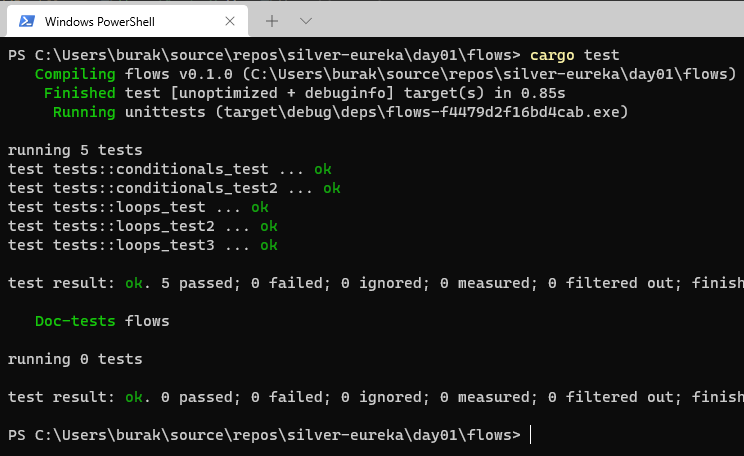
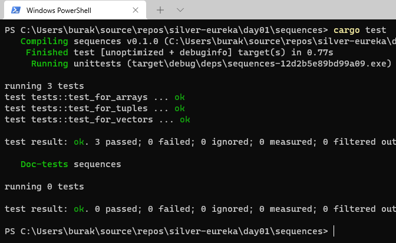
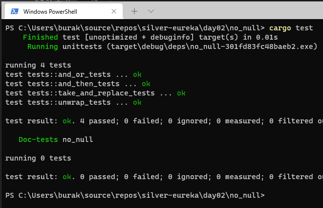
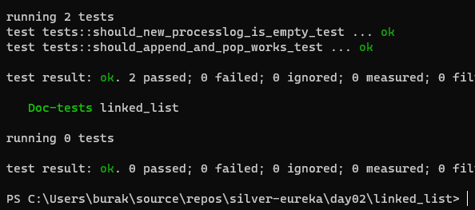
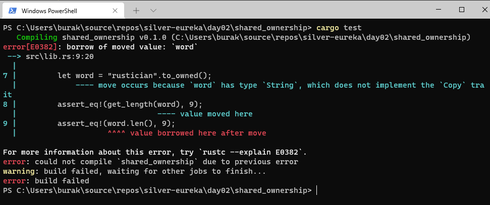
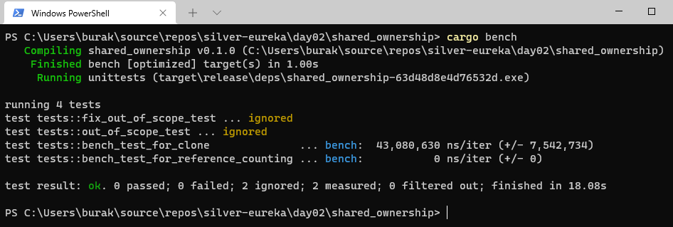

# Rust Programming Cookbook Çalışma Alanım

Bir süre önce aldığım [Rust Programming Cookbook](https://amzn.to/3Bw5ysw) kitabını çalışmak için açtığım bir çalışma alanıdır. İş hayatında sürekli .Net platformunda ve C# ile kod geliştirdiğimden Rust ile yazma alışkanlığım son derece zayıf. Önceden çalıştığım pek çok konuyu unutmuş durumdayım. Kitabın anlattığı kodları copy-paste yapmadan bakarak yazmayı, bu sayede parmaklarımı rust sözdizimine alıştırmayı ve kısa notlar tutarak önceden baktığım konuları biraz daha özümsemeyi amaçlıyorum.

## Ön Hazırlıklar

Her şeyden önce çalışmalarımı Windows 10 tabanlı bir sistemde yapmaktayım. Rust'ın kurulumu için kitabın da önerdiği üzere [https://rustup.rs](https://rustup.rs) adresine gidip indirdiğim installer'ı çalıştırdım. Kurulumun başarılı olup olmadığını görmek için komut satırından _rustc --version_ komutunu çalıştırdım.


Geliştirmeler için Visual Studio Code kullanacağım. Rust eklentisi için command-line interface'i açıp(Ctrl+P) sonrasında _ext install rust-lang.rust_ komutunu çalıştırmak yeterli.


## day01

Kitabın birinci bölümüne ait çalışmalar.

### Komut Satırı ile Temel İşlemler

```bash
# Terminalden aşağıdaki komut çalıştılır ve ilk proje oluşturulur
cargo new wonderful-world

# Örneği çalıştırmak içinse (Tabi kodlama yaptıktan sonra :) )
cd wonderful-world
cargo run
```


### Veri Türleri

```bash
# Bu sefer bir kütüphane oluşturuyoruz
cargo new data-types --lib
cd data-types
# test fonksiyonları üstünden ilerliyoruz
cargo test
```


### Karar Yapıları ve Döngüler

```bash
cargo new flows --lib
cd flows
cargo test
```



### Sandık(Crate) ile Çalışmak

Fonksiyon içeren bir modül oluşturup diğerinden kullanılması. Tipik yürütücü uygulama ve referans olarak kullandığı kütüphane senaryosu.

```bash
# Kütüphane oluşturulması
cargo new rust-matlib --lib

# ana uygulamanın oluşturulması
cargo new calculator

# ana uygulamada bir modül oluşturulması(klasör içinde mod isimli rust dosyası da oluşturulur)
cd calculator
mkdir basic
cd basic
touch mod.rs

# rust-mathlib testlerini çalıştırmak için, o klasörde,
cargo test

# calculator'u çalıştırmak için o klasörde
cargo run
```

calculator'un rust-matlib'i kullanabilmesi için toml dosyasında gerekli dependency eklenmiştir. Ayrıca calculator projesinde basic isimli bir klasör vardır. Burası basic isimli modülü temsil eder.


### Dokümantasyon Eklenmesi

Çok basit anlamda markdown stili kullanılarak yardım dokümanı oluşturulabilyor. /// veya ///! ile bu işlemler gerçekleştirilebiliyor.

```bash
cd rust-matlib
cargo doc
```

Sonrasında silver-eureka/day01/rust-matlib/target/doc/rust_matlib/index.html sayfası açılarak Help içeriği görülebilir.


### Trait Kullanımı

Abstract sınıflara benzetebileceğimiz trait enstrümanı ile aynı davranışı birden fazla struct'ın kullanması mümkün olabilir. Örnekte bir key:value çiftinin okunması, yazılması ile ilgili davranış tanımlamaları yapılmakta ve uygulanmakta.

```bash
cargo new traits --lib
```


### Sequence Tipleri

Tek bir veri türünden oluşabilen ve boyutu değiştirilemeyen dizi, farklı türden veriler barındırabilen ama boyutu değiştirilemeyen Tuple ve generic tipleri kullanıp dinamik olarak boyutu ayarlanabilen Vector tiplerinin kullanım örnekleri.

```bash
cargo new sequences --lib
cd sequences
cargo test
```



## day02

Kitabın ikinci bölümüne ait çalışmalar.

### enum Kullanımı

Pek çok dilde olduğu gibi Rust tarafında da sayıları anlamlı şekilde isimlendirmek için enum türünden faydalanılıyor ama fazlası da olabilir. Enum sabiti özelliklerinde farklı türleri kullanmak, enum sabitine fonksiyonellik kazandırmak, pattern matching ifadelerinde ele almak vs

```bash
mkdir day02
cd day02
cargo new using_enums --lib
cd using_enums
cargo test
```


### Null Olmayan Güzel Bir Dünya

Rust dilinde fonksiyonel dillerin bir geleneği olarak her girdinin karşılığında anlamlı bir çıktının üretilmesi amaçlanır. null tipi yoktur. Bunun yerine Option< T> ve Result<T,E> tipleri kullanılır. Bir hata oluşma ihtimali varsa Result enum sabiti tercih edilir. Bu enum türleri aşağıdaki gibidir.

```rust
pub enum Option<T> {
    Some(T),
    None,
}

pub enum Result<T,E>{
    Ok(T),
    Err(E),
}
```

Örnekte Option tipinin farklı kullanım şekilleri ele alınmakta.

```bash
cargo new no_null --lib
cd no_null
cargo test
```



### Pattern Matching için Verimli Kullanım Senaryoları

Pattern matching kabiliyetinin enum'larla sınırlı olmadığına dair örnek kodlar yer alıyor. _(literal, tuple, String(heap allocation sebebiyle diğer literallerden farklı ama kullanım şekli aynı) türleri ile kullanım, destructuring ve guard mevzusu)_

```bash
cargo new amazing_pattern_matching
cd amazing_pattern_matching
cargo run
```


### Basit Bir Linked List Oluşturmak

Kitabın bir sonraki örneğinde Iterator deseni kullanılan bir örnek yer alıyor. Ancak örnek içerisinde generic türden bir bağlı liste _(Linked List)_ kullanılmakta. Önce bu veri yapısını inşa etmeyi öğrenmek gerekiyor. Bu kodda generic verisyona gitmeden bir sürecin sıralı loglarının bağlı liste olarak tutulduğu basit kurgu söz konusu. Her log bilgisi Node isimli bir struct ile temsil ediliyor. ProcessLog isimli veri yapısı Node örneklerini ardışıl olarak tutan bir bağlı liste veri yapısını temsil ediyor.

```bash
cargo new linked_list --lib
cd linked_list
cargo test
```



### Özel Yineleyiciler _(iterator)_ Oluşturmak

Örnekte basit bir liste veri yapısının elemanlarında ileri yönlü hareket etmek için iterator deseninden nasıl yararlanıldığı ele alınmaktadır. Bu amaçal Iterator ve IntoIterator isimli standart kütüphanedeki trait'lerin generic List veri yapısı için uyarlanması söz konusudur. Bu uyarlama rust derleyicisi için anlamlıdır ki kendi veri türümüz üstünden next fonksiyonu çağırıldığında veya bir for döngüsü ile kullanıldığında nasıl hareket edeceğinin öğretilmesi gerekir

```bash
cargo new custom_iterator --lib
cd custom_iterator
cd src
# örnekte kullanılan generic liste veri yapısını ayrı bir modüle yerleştirmek için klasör açılır
mkdir list
cd list
touch mod.rs
cd ..
cd ..
cargo test
```


### Yararlı Iterator Kullanımları

Ardışıl eleman yapılarında iter metotu arkasından ulaşılabilen kullanışlı pek çok fonksiyon bulunmakta. next, map, fold, collect, zip, find, position, take vs Bu fonksiyonlar sadece nesne kümelerinde hareket etmek değil dönüştürme _(transformation)_, filtreleme, toplu hesaplama _(aggregation)_ gibi işlemler için de önemli. Örnekte bu fonksiyon kullanımlarına yer veriliyor.

```bash
cargo new iterations --lib
cd iterations
cargo test
```


### Unsafe Kodlama

Rust'ın C diline yakınlaştığı yerlerden birisi de unsafe halidir. Unsafe modda iken derleyicinin uygulamayı kontrol eden güven mekanizması kapatılır. Unsafe sayılan fonksiyonların çağırılmasında, mutable işaretlenmiş statik değerlere erişmekte veya değiştirmekte, pointer referanslarının kaldırılmasında vs kullanılabilir.

```bash
cargo new easy_unsafe --lib
cd easy_unsafe
cargo test
```


### Paylaşılan Ownership

Rust dilinde bir garbage collector mekanizması yoktur. Bunun yerine sahiplenme _(ownership)_ ve ödünç alma _(borrowing)_ kavramları öne çıkar ve oldukça önemlidirler. Mevzu bir değişkenin yaşamı ile ilgilidir. Normal şartlarda scope'lar değişkenleri sahiplenirler ve scope dışına çıkılınca değişken artık kullanılamaz. Tabii sahiplikler iç scope'lara transfer edilebilir ve tekrar geri gelebilir. Geçici transferlerde ödünç alma kullanılır ancak bazı hallerde yönetimleri karmaşıktır. Kitabın bu kısmında paylaşılmış sahiplik ile ilgili örnek kodlar yer alıyor ve smart pointer kullanımının performans açısından önemi vurgulanıyor.

```bash
cargo new shared_ownership --lib
cd shared_ownership

# Örnekte benchmark testi yapıldığından rust'ın nightly build sürümü gerekiyor.
rustup default nightly

# test için
cargo test

# benchmark sonuçlarını görmek için
cargo bench
```



